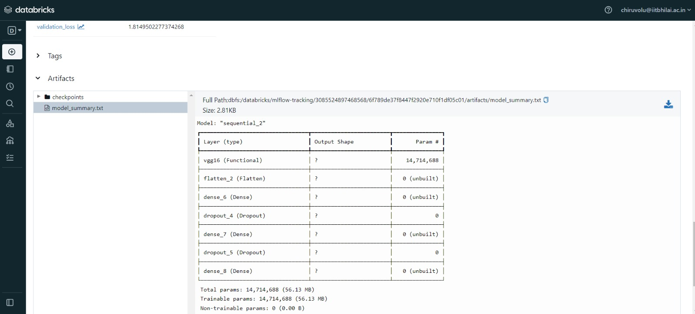
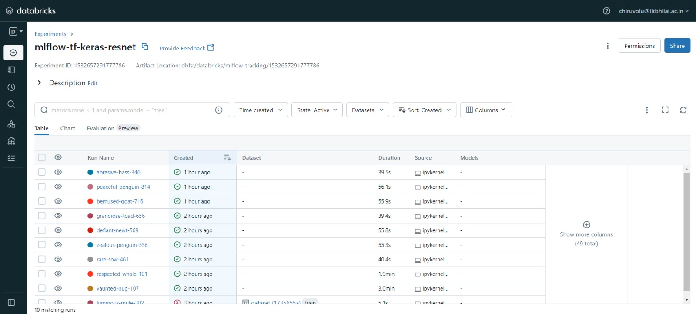
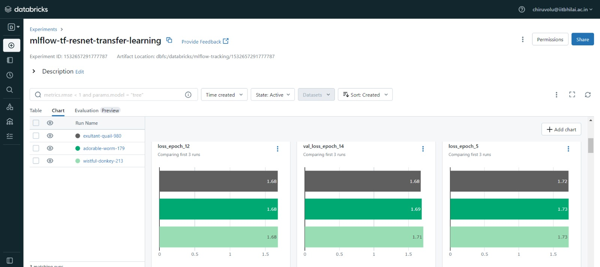
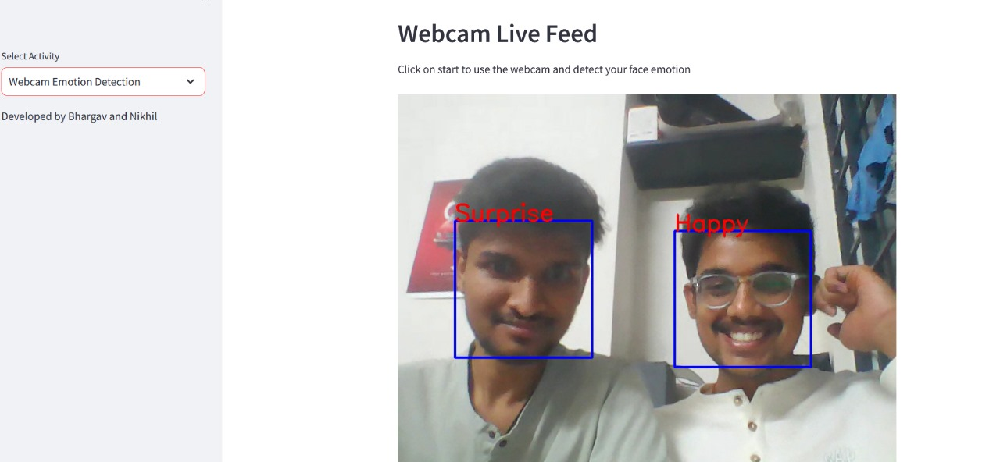
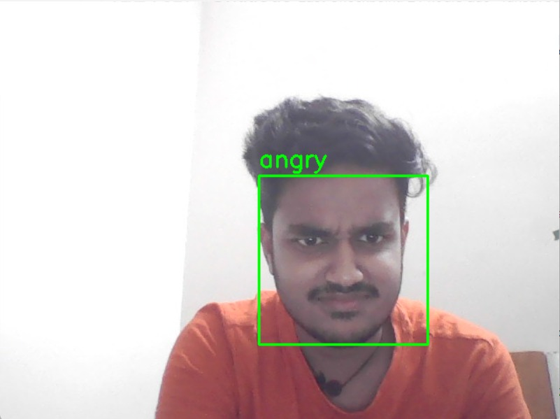
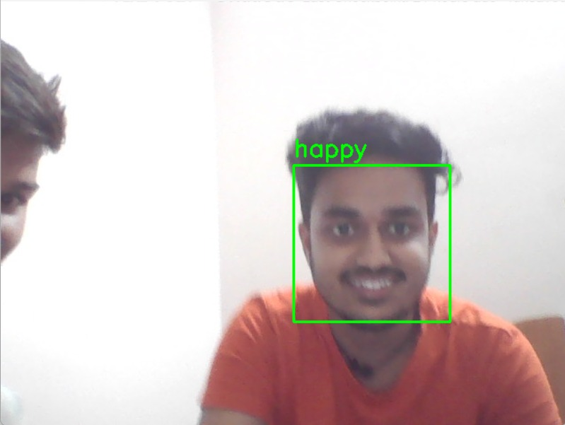

# Computer System Design Project-Face Emotion Recognition on Edge Devices

## Overview
This repository contains the code and documentation for the Face Emotion Recognition on Edge Devices project, developed as part of CS559, Project Phase 1 at IIT Bhilai.
The project code can found in the `csd-mlflowpart.ipynb` file and the real time can be found under `main.py` file. Report can be found under `12140460_12140530_Project-Phase2.pdf`.

### Team Members
- C Nikhil (12140530)
- B Sri Bhargav Ram (12140460)

## Project Description
### 1. Data Pre-processing
We utilized the FER2013 dataset, The training set consists of 28,709 examples and the public test set consists of 3,589 examples. 

A sample images from the training and validation dataset:

  

  

A sample image from the testing dataset:

### 2. Models Used
Our project successfully identified emotions on human face, achieving a accuracy
of approximately 70%. We conducted extensive experiments, exploring various models such as
Convolutional Neural Networks (CNN)-2 models used,Resnet model,VGG16 model,RegNet Model, Efficient-Net model,Densenet model,MobileNet model for emotion recognition.We have successfully implemented an ensemble approach using the three models that yielded the highest accuracy. This ensemble leverages the predictive power of the top-performing models to enhance the overall performance, resulting in a more robust and accurate system

### 3. How to Run Locally:

Please clone this GitHub repository and ensure that all dependencies are installed. 
You can do this by running the command `pip install -r requirements.txt`. Once the dependencies are installed, execute the command `streamlit run main.py` to launch the application.

### 4. Mlflow :
We utilized MLflow in our project to enhance visualization and gain insights into
the model’s performance. MLflow facilitated tracking and comparison of various experiments, providing detailed metrics on training and validation processes. This enabled us
to make informed decisions and optimize our models effectively.

These are some of the observations in Databricks(Ml-flow):

  

  

### 5. Real Time Testing and Deployment:
We ran these models ( We have used Regnet Model because of it's better accuracy and low space to deployment purposes) locally using streamlit and achieved good accuracy. Here are some sample images used during testing:

  

  

  

  

### 6. Individual Contributions
- **Chiruvolu Nikhil:** Developed ML models, made our model real-time.
Integrated ML-fLow into the project. Also tried deployment using flask
- **Bollapragada Sri Bhargav:** Integration with webapp using streamlit and made frontend
ui .Developed resnet,densenet,regnet model.Tried developing frontend with Tensorflow js.

